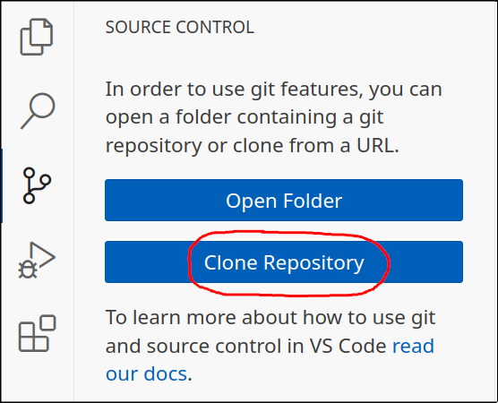

# NeuralClosure

Tutorials for learning neural closure models for various discretized PDEs,
including

- the viscous Burgers equations in 1D
- the incompressible Navier-Stokes equations in 2D

The tutorials are provided as Julia scripts. Markdown and Jupyter notebook
versions are auto-generated from the Julia source files using
[Literate.jl](https://github.com/fredrikekre/Literate.jl).

| Burgers | Navier-Stokes |
| :-----: | :-----------: |
| [Source file](burgers.jl) | [Source file](navier_stokes_spectral.jl) |
| [Markdown](generated/burgers.md) | [Markdown](generated/navier_stokes_spectral.md) |
| [Notebook](generated/burgers.ipynb) | [Notebook](generated/navier_stokes_spectral.ipynb) |

See the script [`make.jl`](./make.jl) for converting the script to markdown or
notebook.

## Running the tutorials

### Option 1: Running locally on your machine

To run the tutorials locally, you need to install Julia on your machine. An
editor such as VSCode can also be useful. Proposed workflow:

1. Install Julia from one of the two options:

   - the official [Juliaup](https://github.com/JuliaLang/juliaup) version
     manager. This is the preferred way, as you will get notified about updates
     to Julia. It requires typing a line into your command line. See the
     Juliaup [README](https://github.com/JuliaLang/juliaup/blob/main/README.md)
     for installation instructions.
   - the official [downloads page](https://julialang.org/downloads/) (select
     the binary for your platform)

   Do _not_ install Julia from your platform's package manager (e.g. `apt` on
   Ubuntu), as these versions may have flaws).
1. Install [VSCode](https://code.visualstudio.com/)
1. Install the [Julia extension](https://code.visualstudio.com/docs/languages/julia) for VSCode.
   This gives syntax highlighting, code execution with `Shift` + `Enter` etc.
1. Clone the repository in VSCode:
    1. Create a new window: `Ctrl`/`Cmd` + `Shift` + `N`
    1. Open the _Source control_ side panel with `Ctrl`/`Cmd` + `Shift` + `G`
    1. Click the button `Clone Repository`. If you do not see this button,
       there should be an instruction there instead to first install
       [Git](https://git-scm.com/downloads).
       
    1. Paste the following URL:

       ```
        https://github.com/agdestein/NeuralClosure/
       ```

    1. Select a location for where you want the folder
    1. Open the cloned repository
1. *Activate the project:* A notification should pop up asking you about the
   environment. If not, click on the `v1.9` environment symbol in the bottom
   bar of VSCode, or, alternatively, open the command palette (`Ctrl`/`Cmd` +
   `Shift` + `P`), start typing `julia`, and select
   `Julia: Change current environment`.
   Set the environment to `NeuralClosure`. 
1. In the file explorer (`Ctrl`/`Cmd` + `Shift` + `E`), you should see the
   files. Open `generated/burgers.ipynb`.
   Execute the notebook one cell at the time with `Shift` + `Enter`.
   Output and plots should appear below each cell.
   Start with uncommenting and executing the cell with
   `Pkg.instantiate()`, which will install the local dependencies.

Note: If you do not like the notebook format, you can alternatively open the
source script `burgers.jl` or the markdown file `generated/burgers.md`. Both
can be executed interactively one Julia line at the time with `Shift` +
`Enter`. Then a separate Julia REPL will pop up, and plots will appear in a
separate plot pane. To visualize the LaTeX equations, open the markdown file
and press `Ctrl`/`Cmd` + `Shift` + `V` to render the markdown (with equations)
in a new pane.

### Option 2: Running on Google Colab

If you do not want to install Julia locally, you can run it on a Google
cloud machine instead. This requires a Google account. Steps:

1. Open [Google Colab](https://colab.research.google.com/)
2. Sign in to your Google account. 
3. Click on `File > Upload Notebook > GitHub` and paste the following url:
   ```
   https://github.com/agdestein/NeuralClosure/
   ```
   Select `generated/burgers.ipynb`.
4. Follow the Colab instructions in the top of the notebook.
